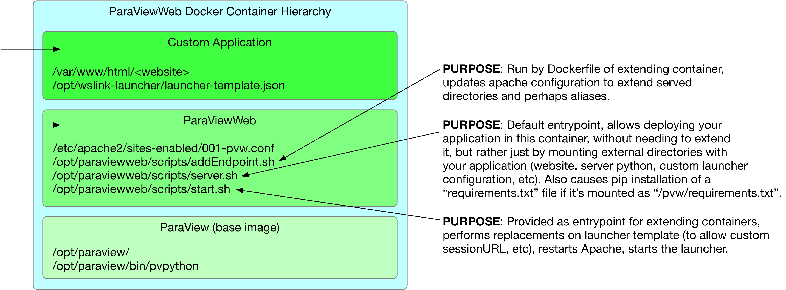

# ParaView + ParaViewWeb Containers

In the [ParaView-Superbuild](https://gitlab.kitware.com/paraview/paraview-superbuild) repository we have a Dockerfile for building various configurations of ParaView.  Additionally, there are a couple layers of Dockerfiles in this repository that can build upon the resulting ParaView containers to support ParaViewWeb applications.  This document aims to describe that container hierarchy, and how you can make use of the images.  The stack of containers looks like the picture below:

<center>

</center>

## Layer One - ParaView

At the bottom of the stack we need to start with a container which has ParaView installed.  The Dockerfile for building these containers is located in the [ParaView-Superbuild](https://gitlab.kitware.com/paraview/paraview-superbuild) repository, and it supports two basic configurations, `EGL` and `OSMesa`.

The `EGL` builds are useful for deployment on machines with NVidia graphics cards supporting driver version `384` or later.  The `OSMesa` builds are useful when no such graphics card and driver are available, and in that case you will have the choice of using `llvm` or `swr` backends at runtime.  In all of these images, ParaView is installed at `/opt/paraview`.

The Dockerfile used to build these images allows you to specify the version of ParaView and the ParaViewSuperbuild you wish to use when building the container.  To achieve this, use the build arguments `PARAVIEW_TAG` and `SUPERBUILD_TAG`.  For example, to build against a tagged version like `v5.6.0`, the commands might look like:

```
cd <pv-superbuild-src-dir>/Scripts/docker/ubuntu
docker build --build-arg PARAVIEW_TAG=v5.6.0 --build-arg SUPERBUILD_TAG=v5.6.0 --RENDERING="egl" -t pv-v5.6.0-egl .
```

You could also change `v5.6.0` in the command above to `master` to build against the master versions, or change 'egl' to 'osmesa' to build with software rendering, for example.

## Layer Two - ParaViewWeb

The next layer in the stack builds on the ParaView layer and adds an apache webserver, along with setting up some infrastructure that supports ParaViewWeb applications in general.  When you build this image, you can specify the base ParaView image to build on top of using the `BASE_IMAGE` build argument.  For example:

```
cd tools/docker/paraviewweb
docker build --build-arg BASE_IMAGE=pv-v5.6.0-egl -t pvw-v5.6.0-egl .
```

The images built from this Dockerfile are designed to be used in one of two ways, either run directly with a fully external application (www, server, and launcher directories), or else extended by another image (see, for example, the "demo" or "visualizer").  For more details on extending the paraviewweb base image, see the [Build Yours](build_yours.html) document.

### Fully external direct run

We have created a separate [repository](https://github.com/Kitware/paraviewweb-demo) as an example of a fully external demo web application application.  This section describes some of the internals which make that possible.

In order to run this image directly as a paraviewweb application, there are a few assumptions we make about the external directories as well as the locations of some key pieces.  You should first create a directory structure where your application lives (we'll call it `<APP_ROOT>` below) following this structure:

```
    <APP_ROOT>/
    <APP_ROOT>/www/
    <APP_ROOT>/launcher/config.json
    <APP_ROOT>/requirements.txt        (optional)
    <APP_ROOT>/endpoints.txt           (optional)
```

The "APP_ROOT/www/" directory should contain your web application files, while the "APP_ROOT/launcher/config.json" file should be your launcher configuration, either with or without replacement values like the "SESSION_URL_ROOT" or "EXTRA_PVPYTHON_ARGS".  See the demo launcher [config](https://github.com/Kitware/paraviewweb-demo/blob/master/pvw/launcher/config.json) for an example configuration file with those replacement values.  You also have the option to include a `requirements.txt` at the root of the directory structure, which can contain any extra python modules your application may need.  If `requirements.txt` is present, any modules it contains will be installed when the container is started.  As another convenience, you can supply an `endpoints.txt` file in the `<APP_ROOT>` directory with the mappings you want the internal apache server to set before starting.  That file should contain one mapping per line, where each line consists of an alias and a path, separated by a space.  See the demo [endpoints](https://github.com/Kitware/paraviewweb-demo/blob/master/pvw/endpoints.txt) file for an example.

The rest of the `<APP_ROOT>` directory structure is up to you.

The second thing you must do for the above use case is mount "APP_DIR" as "/pvw" when you run the container.  You can also mount other directories as needed, but this at least is required when running the paraviewweb container:

```
docker run -v <APP_ROOT>:/pvw ... -ti pvw-v5.6.0-osmesa
```

#### Note on extra python dependencies

To support the case where your fully external application needs extra python modules, the default entrypoint of the paraviewweb image will look for a `requirements.txt` file in the `<APP-ROOT>` directory and install those using:

```
    pip install -r "/pvw/requirements.txt"
```

#### Other path assumptions to be aware of

The internal apache configuration in images built with this Dockerfile assumes a path to the proxy mapping file, which is set up in the `RUN` section of the paraviewweb Dockerfile:

```
/opt/launcher/proxy-mapping.txt
```

As a result your <APP_ROOT/launcher/config.json should match that expectation and contain the following within the `configuration` section:

```
    "proxy_file": "/opt/launcher/proxy-mapping.txt",
```

Also recall from above that within the parent image, `pvpython` was installed in "/opt/paraview/bin/pvpython", so that should be reflected in your launcher configuration file as well.

One final path-related note on this "fully external" application case: the paraviewweb Dockerfile creates a log directory for you, which you can just point to in your launcher config (in the `configuration` section) as follows:

```
     "log_dir": "/opt/launcher/log",
```

However, you should be able to override that log directory if you prefer your logs to end up in the external directory.

## Layer Three - The web application

This repository provides an example application container built on top of the paraviewweb one, see `tools/docker/visualizer/` for details.  You can also read the [Build Yours](build_yours.html) document for more details on building a web application container on top of paraviewweb.
